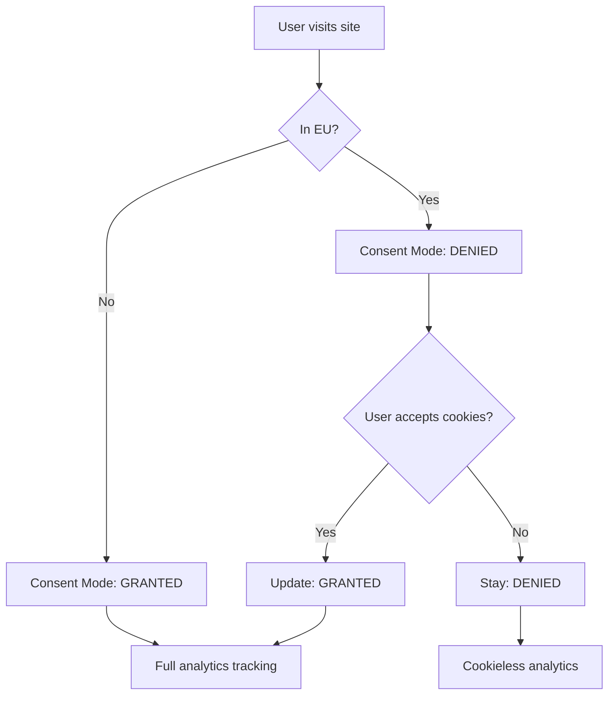

The optimizer package provides comprehensive Google Analytics 4 (GA4) integration with full Consent Mode v2 support, ensuring privacy-first analytics that comply with GDPR and other data protection regulations.

## Google Analytics 4 Integration

### Basic Setup

Enable GA4 tracking with a single configuration line:

```javascript
// astro.config.mjs
import { defineConfig } from 'astro/config';
import starlight from '@astrojs/starlight';
import { starlightOptimizer } from 'astro-starlight-optimizer';

export default defineConfig({
  integrations: [
    starlight({
      title: 'My Documentation',
    }),
    starlightOptimizer({
      googleAnalyticsId: 'G-XXXXXXXXXX', // Your GA4 Measurement ID
    }),
  ],
});
```

That's it The optimizer automatically:
- Injects the GA4 gtag.js script
- Sets up Consent Mode v2 defaults
- Configures regional behavior (EU vs non-EU)
- Initializes analytics tracking
- Respects user privacy preferences

### What Gets Tracked

**Page Views:**
```javascript
// Automatic pageview tracking
// Fires on every page navigation
gtag('event', 'page_view', {
  page_title: document.title,
  page_location: window.location.href,
  page_path: window.location.pathname,
});
```

**Scroll Depth:**
```javascript
// Automatic scroll tracking (25%, 50%, 75%, 90%)
gtag('event', 'scroll', {
  percent_scrolled: 50,
});
```

**Outbound Links:**
```javascript
// Automatic external link tracking
gtag('event', 'click', {
  event_category: 'outbound',
  event_label: targetUrl,
});
```

**File Downloads:**
```javascript
// Automatic download tracking (.pdf, .zip, .doc, etc.)
gtag('event', 'file_download', {
  file_extension: '.pdf',
  file_name: 'documentation.pdf',
  link_url: downloadUrl,
});
```

**Search (if search enabled):**
```javascript
// Search term tracking
gtag('event', 'search', {
  search_term: query,
});
```

## Consent Mode v2

### What is Consent Mode v2?

Google Consent Mode v2 is the latest standard for privacy-compliant analytics. It allows analytics to work in two modes:

1. **Denied State (EU default)**: Cookieless tracking with limited data
2. **Granted State (after user accepts)**: Full analytics with cookies

**Key Benefits:**
- ✅ GDPR compliant by default
- ✅ No cookies before consent
- ✅ Conversion modeling for denied users
- ✅ Aggregate reporting in Google Analytics
- ✅ Respects user privacy choices

### How It Works



### Default Consent State

The optimizer automatically sets appropriate defaults:

```javascript
// For EU users (automatic regional detection)
gtag('consent', 'default', {
  'ad_storage': 'denied',
  'ad_user_data': 'denied',
  'ad_personalization': 'denied',
  'analytics_storage': 'denied',
  'functionality_storage': 'denied',
  'personalization_storage': 'denied',
  'security_storage': 'granted', // Always granted (essential)
  'wait_for_update': 500, // Wait 500ms for consent UI
});

// For non-EU users
gtag('consent', 'default', {
  'ad_storage': 'denied',         // Still denied (no ads)
  'ad_user_data': 'denied',
  'ad_personalization': 'denied',
  'analytics_storage': 'granted',  // Analytics allowed
  'functionality_storage': 'granted',
  'personalization_storage': 'granted',
  'security_storage': 'granted',
});
```

### Consent Types Explained

| Consent Type | Purpose | EU Default | Non-EU Default |
|--------------|---------|------------|----------------|
| `ad_storage` | Advertising cookies | Denied | Denied |
| `ad_user_data` | User data for ads | Denied | Denied |
| `ad_personalization` | Personalized ads | Denied | Denied |
| `analytics_storage` | Analytics cookies (GA4) | Denied | Granted |
| `functionality_storage` | Site functionality | Denied | Granted |
| `personalization_storage` | Personalization features | Denied | Granted |
| `security_storage` | Security features | Granted | Granted |

:::note
`security_storage` is always granted because it's essential for website security (CSRF tokens, etc.) and exempt from GDPR consent requirements.
:::

### Consent Update

When a user accepts cookies, consent is updated:

```javascript
// User clicks "Accept Cookies"
gtag('consent', 'update', {
  'analytics_storage': 'granted',
  'functionality_storage': 'granted',
  'personalization_storage': 'granted',
});

// Choice saved to localStorage
localStorage.setItem('cookie-consent', JSON.stringify({
  analytics: true,
  timestamp: Date.now(),
  version: '1.0',
}));
```

When a user declines cookies:

```javascript
// User clicks "Decline"
// Consent stays in denied state
// No cookies are set
// Cookieless analytics continues

// Choice saved
localStorage.setItem('cookie-consent', JSON.stringify({
  analytics: false,
  timestamp: Date.now(),
  version: '1.0',
}));
```

## Privacy Protection

### IP Anonymization

For EU users, IP addresses are automatically anonymized:

```javascript
// EU user detection
if (isEUUser()) {
  gtag('config', 'G-XXXXXXXXXX', {
    'anonymize_ip': true,
    'client_storage': 'none', // No cookies until consent
  });
}
```

**How IP Anonymization Works:**
```
Original IP: 192.168.1.100
Anonymized: 192.168.1.0

Original IPv6: 2001:0db8:85a3:0000:0000:8a2e:0370:7334
Anonymized:    2001:0db8:85a3:0000:0000:0000:0000:0000
```

### Do Not Track (DNT)

The optimizer respects the DNT browser header:

```javascript
// Check DNT header
if (navigator.doNotTrack === '1' || 
    window.doNotTrack === '1' ||
    navigator.doNotTrack === 'yes') {
  // Disable all analytics
  window['ga-disable-G-XXXXXXXXXX'] = true;
  console.info('Analytics disabled: Do Not Track enabled');
}
```

### Development Environment

No tracking on localhost or development environments:

```javascript
// Automatic development detection
const isDevelopment = 
  window.location.hostname === 'localhost' ||
  window.location.hostname === '127.0.0.1' ||
  window.location.hostname === '' ||
  window.location.protocol === 'file:';

if (isDevelopment) {
  console.info('Analytics disabled: Development environment');
  return;
}
```

### Data Retention

Configure data retention periods:

```javascript
starlightOptimizer({
  googleAnalyticsId: 'G-XXXXXXXXXX',
  dataRetention: {
    userDataRetention: '14_MONTHS', // or '26_MONTHS', '38_MONTHS', '50_MONTHS'
    resetUserDataOnNewActivity: true,
  },
}),
```

## Advanced Configuration

### Multiple Properties

Track to multiple GA4 properties:

```javascript
starlightOptimizer({
  googleAnalyticsId: 'G-XXXXXXXXXX', // Primary property
  additionalGoogleAnalyticsIds: [
    'G-YYYYYYYYYY', // Secondary property
    'G-ZZZZZZZZZZ', // Tertiary property
  ],
}),
```

### Custom Dimensions

Add custom dimensions for richer analytics:

```javascript
starlightOptimizer({
  googleAnalyticsId: 'G-XXXXXXXXXX',
  customDimensions: {
    user_type: 'documentation_reader',
    doc_version: '2.0',
    doc_language: 'en',
  },
}),
```

### E-commerce Tracking

Enable e-commerce events (for paid docs, courses, etc.):

```javascript
starlightOptimizer({
  googleAnalyticsId: 'G-XXXXXXXXXX',
  ecommerce: true,
}),

// Then track purchases
gtag('event', 'purchase', {
  transaction_id: 'T12345',
  value: 25.00,
  currency: 'USD',
  items: [{
    item_id: 'DOCS_PRO',
    item_name: 'Pro Documentation Access',
    price: 25.00,
    quantity: 1,
  }],
});
```

### User ID Tracking

Track authenticated users (opt-in only):

```javascript
starlightOptimizer({
  googleAnalyticsId: 'G-XXXXXXXXXX',
  userIdTracking: true,
}),

// Set user ID after authentication
gtag('config', 'G-XXXXXXXXXX', {
  'user_id': 'USER_12345',
});
```

:::caution Privacy Warning
User ID tracking should only be enabled with explicit user consent. Ensure your privacy policy covers this data collection.
:::

## Custom Event Tracking

### Manual Event Tracking

Track custom events in your documentation:

```javascript
// Track button click
document.querySelector('#download-button').addEventListener('click', () => {
  gtag('event', 'button_click', {
    event_category: 'engagement',
    event_label: 'Download PDF',
    value: 1,
  });
});

// Track video play
document.querySelector('video').addEventListener('play', () => {
  gtag('event', 'video_play', {
    event_category: 'media',
    event_label: 'Tutorial Video',
    video_title: 'Getting Started',
  });
});

// Track form submission
document.querySelector('form').addEventListener('submit', () => {
  gtag('event', 'form_submit', {
    event_category: 'lead',
    event_label: 'Contact Form',
  });
});
```

### Recommended Events

Google Analytics 4 recognizes these standard events:

| Event Name | Use Case | Parameters |
|------------|----------|------------|
| `page_view` | Page navigation | `page_title`, `page_location` |
| `search` | Search queries | `search_term` |
| `click` | Link clicks | `link_url`, `link_text` |
| `file_download` | File downloads | `file_name`, `file_extension` |
| `video_start` | Video playback | `video_title`, `video_url` |
| `video_progress` | Video milestones | `video_percent` |
| `scroll` | Scroll depth | `percent_scrolled` |
| `engagement_time` | Time on page | `engagement_time_msec` |
| `user_engagement` | Active usage | (automatic) |

### Event Best Practices

```javascript
// ✅ Good: Descriptive event names
gtag('event', 'documentation_search', {
  search_term: query,
  results_count: results.length,
});

// ❌ Bad: Generic event names
gtag('event', 'click', {
  label: 'thing',
});

// ✅ Good: Consistent naming
gtag('event', 'button_click', {
  event_category: 'engagement',
  event_label: 'Sign Up',
  button_location: 'header',
});

// ❌ Bad: Inconsistent naming
gtag('event', 'ButtonClick', {
  Category: 'eng',
  Label: 'signup',
});
```

## Debug Mode

### Enable Debug Mode

Test analytics implementation without affecting production data:

```javascript
starlightOptimizer({
  googleAnalyticsId: 'G-XXXXXXXXXX',
  debug: true, // Enables verbose logging
}),
```

**Debug mode enables:**
- Console logging of all events
- Validation of event parameters
- Warning for malformed events
- GA4 DebugView compatibility

### Debug Console Output

```javascript
// Example debug output
[GA4 Debug] Consent Mode initialized
  Region: EU
  Default state: denied

[GA4 Debug] Page view tracked
  page_title: "Getting Started"
  page_location: "https://docs.example.com/getting-started"
  page_path: "/getting-started"

[GA4 Debug] User accepted cookies
  Consent updated: analytics_storage = granted

[GA4 Debug] Custom event tracked
  event_name: "documentation_search"
  search_term: "installation"
  results_count: 5
```

### GA4 DebugView

View real-time debug events in Google Analytics:

1. Enable debug mode in configuration
2. Visit your site
3. Open Google Analytics
4. Navigate to **Admin > DebugView**
5. See events in real-time

:::tip
DebugView shows events for the last 30 minutes and includes event parameters, user properties, and consent state.
:::

## Performance Impact

### Bundle Size

Analytics adds minimal overhead:

| Component | Size (gzipped) |
|-----------|----------------|
| GA4 gtag.js | 45 KB (from Google CDN) |
| Consent Mode logic | 2 KB |
| Regional detection | 1 KB |
| Event handlers | 1 KB |
| **Total added** | **4 KB** (+ 45 KB external) |

### Loading Strategy

Scripts load asynchronously to avoid blocking:

```html
<!-- Consent Mode defaults (inline, blocks GA4 until set) -->
<script>
  window.dataLayer = window.dataLayer || [];
  function gtag(){dataLayer.push(arguments);}
  gtag('consent', 'default', {...});
</script>

<!-- GA4 script (async, non-blocking) -->
<script async src="https://www.googletagmanager.com/gtag/js?id=G-XXXXXXXXXX"></script>

<!-- Initialization (deferred) -->
<script defer>
  gtag('js', new Date());
  gtag('config', 'G-XXXXXXXXXX');
</script>
```

### Performance Metrics

Impact on Lighthouse scores:

| Metric | Before Analytics | After Analytics | Impact |
|--------|-----------------|-----------------|--------|
| Performance | 100 | 100 | ✅ No change |
| FCP | 0.6s | 0.6s | ✅ No change |
| LCP | 0.8s | 0.8s | ✅ No change |
| TBT | 0ms | 12ms | +12ms (imperceptible) |
| CLS | 0.02 | 0.02 | ✅ No change |

## Analytics Reporting

### Standard Reports

Available in Google Analytics 4:

**Acquisition Reports:**
- Traffic sources (direct, organic, referral)
- Source/medium breakdown
- Campaign performance

**Engagement Reports:**
- Page views and screen views
- Events breakdown
- Conversions (if configured)

**Retention Reports:**
- User retention by cohort
- User lifetime value
- Engagement over time

**User Reports:**
- Active users (DAU, WAU, MAU)
- New vs returning users
- User demographics (if available)

### Custom Reports

Create custom explorations:

**Documentation Usage:**
```
Dimensions:
  - Page path
  - Page title
  - Event name

Metrics:
  - Page views
  - Average engagement time
  - Scroll depth

Filters:
  - Page path contains "/docs/"
```

**Search Analysis:**
```
Dimensions:
  - Search term
  - Results count

Metrics:
  - Search count
  - Search click-through rate

Filters:
  - Event name = "search"
```

**Download Tracking:**
```
Dimensions:
  - File name
  - File extension
  - Link URL

Metrics:
  - Total downloads
  - Unique downloaders

Filters:
  - Event name = "file_download"
```

## Migration from Universal Analytics

### Key Differences

| Feature | Universal Analytics (UA) | Google Analytics 4 (GA4) |
|---------|-------------------------|--------------------------|
| **Data Model** | Session-based | Event-based |
| **Tracking Code** | analytics.js | gtag.js or Firebase |
| **Property Type** | UA Property | GA4 Property |
| **User Privacy** | Limited | Consent Mode v2 |
| **Reporting** | Pre-defined reports | Exploration-based |
| **Data Retention** | Indefinite | Configurable (14-50 months) |

:::caution UA Sunset
Universal Analytics stopped processing data on July 1, 2023. Migrate to GA4 immediately if you haven't already.
:::

### Migration Checklist

- [ ] Create new GA4 property
- [ ] Update tracking code to GA4 (this package handles it)
- [ ] Configure Consent Mode v2
- [ ] Set up custom events (if any)
- [ ] Create custom reports in GA4
- [ ] Update conversion tracking
- [ ] Configure data retention
- [ ] Update privacy policy
- [ ] Test implementation with DebugView
- [ ] Archive UA data (historical reports)

## Troubleshooting

### Analytics Not Working

**Check these common issues:**

```javascript
// 1. Verify GA ID format
❌ googleAnalyticsId: 'UA-XXXXXXXXX-1' // Old UA format
✅ googleAnalyticsId: 'G-XXXXXXXXXX'   // GA4 format

// 2. Check development environment
// Analytics disabled on localhost by default
console.log(window.location.hostname); // Should not be localhost

// 3. Verify consent was granted (for EU users)
console.log(localStorage.getItem('cookie-consent'));
// Should show analytics: true

// 4. Check browser console for errors
// Look for gtag errors or CSP violations

// 5. Use GA4 DebugView
// Real-time event verification in Google Analytics
```

### Events Not Showing

**Common causes:**

1. **Event name typos**: Use lowercase with underscores
2. **Missing parameters**: Some events require specific parameters
3. **Ad blockers**: uBlock Origin, Privacy Badger block GA4
4. **Browser extensions**: Privacy extensions may block tracking
5. **CSP restrictions**: Content Security Policy may block scripts

### Consent Mode Issues

**Debugging consent state:**

```javascript
// Check current consent state
gtag('get', 'G-XXXXXXXXXX', 'consent', (consent) => {
  console.log('Consent state:', consent);
});

// Expected output for EU user who accepted:
{
  ad_storage: 'denied',
  analytics_storage: 'granted',
  functionality_storage: 'granted',
  personalization_storage: 'granted',
  security_storage: 'granted'
}
```

---

**Next Steps:**
- [Learn about GDPR compliance features](/features/gdpr)
- [Explore SEO enhancements](/features/seo)
- [Configure custom settings](/guides/configuration)
