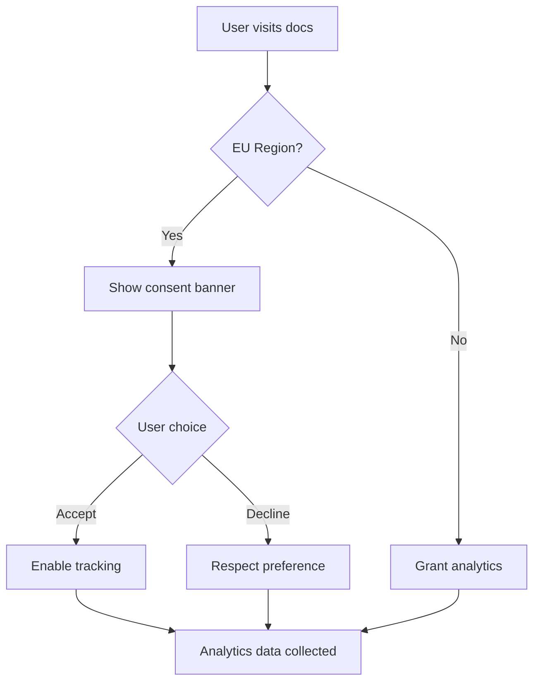
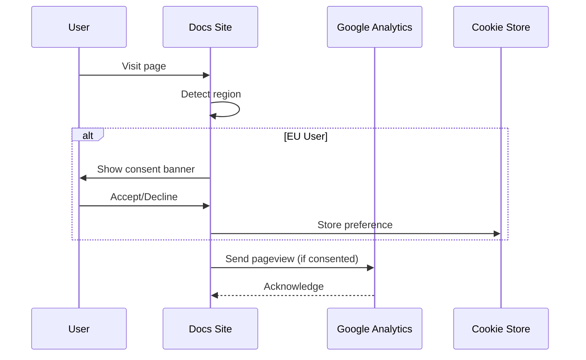
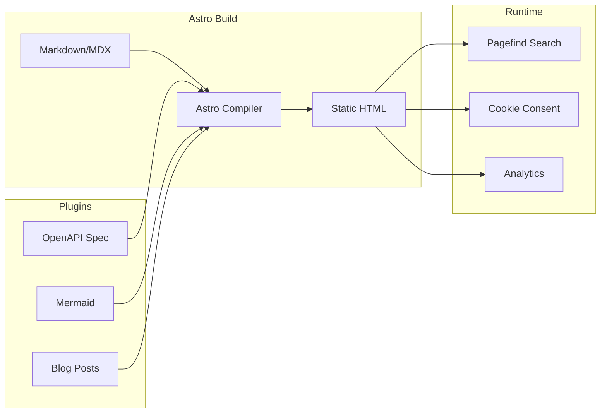

import { Tabs, TabItem, Card, CardGrid, LinkCard, Steps, FileTree, Badge, Aside, Icon, Code } from '@astrojs/starlight/components';

This page showcases all the components and plugins available in this documentation template. Use them to create rich, interactive documentation pages.

## Tabs

Use tabs to organize content by context, such as different package managers or languages.

<Tabs>
  <TabItem label="npm" icon="seti:npm">
    ```bash
    npm install astro-starlight-docs-template
    ```
  </TabItem>
  <TabItem label="yarn" icon="seti:yarn">
    ```bash
    yarn add astro-starlight-docs-template
    ```
  </TabItem>
  <TabItem label="pnpm" icon="seti:config">
    ```bash
    pnpm add astro-starlight-docs-template
    ```
  </TabItem>
  <TabItem label="bun" icon="seti:default">
    ```bash
    bun add astro-starlight-docs-template
    ```
  </TabItem>
</Tabs>

## Cards

### Standard Cards

<CardGrid>
  <Card title="Analytics" icon="star">
    Google Analytics 4 with Consent Mode v2 and IP anonymization.
  </Card>
  <Card title="GDPR" icon="approve-check">
    Automatic GDPR compliance with regional cookie consent.
  </Card>
  <Card title="SEO" icon="magnifier">
    Open Graph, Twitter Cards, and Schema.org structured data.
  </Card>
  <Card title="LLM Support" icon="information">
    AI-friendly metadata and `llms.txt` generation.
  </Card>
</CardGrid>

### Staggered Cards

<CardGrid stagger>
  <Card title="One Command" icon="rocket">
    Run `npx astro-starlight-docs-template init` and you're done.
  </Card>
  <Card title="Zero Config" icon="setting">
    Sensible defaults for everything. Customize only what you need.
  </Card>
</CardGrid>

### Link Cards

<CardGrid>
  <LinkCard title="Quick Start Guide" description="Get up and running in 2 minutes" href="/astro-starlight-docs-template/getting-started/quick-start/" />
  <LinkCard title="Features Overview" description="See everything this template offers" href="/astro-starlight-docs-template/features/overview/" />
</CardGrid>

## Steps

Use the Steps component for sequential instructions.

<Steps>

1. **Install the package**

   ```bash
   npx astro-starlight-docs-template init
   ```

2. **Answer the prompts**

   Provide your Google Analytics ID, site URL, and preferences.

3. **Build your site**

   ```bash
   npm run build
   ```

4. **Deploy**

   Push to GitHub Pages, Vercel, Netlify, or any static host.

</Steps>

## File Tree

Visualize your project structure.

<FileTree>

- src/
  - components/
    - **Footer.astro** (custom footer)
  - content/
    - blog/
      - welcome.md
      - openapi-support.md
    - docs/
      - index.mdx
      - getting-started/
        - quick-start.md
        - installation.md
      - features/
        - overview.md
        - analytics.md
      - guides/
        - **component-showcase.mdx** (this file)
  - styles/
    - custom.css
- schemas/
  - openapi.yaml
- public/
  - cookie-consent.js
  - favicon.svg
- astro.config.mjs
- package.json

</FileTree>

## Badges

Inline badges for status indicators:

- <Badge text="Stable" variant="tip" /> Production-ready features
- <Badge text="Beta" variant="caution" /> Features in testing
- <Badge text="Deprecated" variant="danger" /> Features being removed
- <Badge text="New" variant="note" /> Recently added features

## Asides

:::note
This is a **note** aside. Use it for supplementary information.
:::

:::tip[Pro Tip]
This is a **tip** aside with a custom title. Use it for helpful advice.
:::

:::caution
This is a **caution** aside. Use it for potential issues.
:::

:::danger
This is a **danger** aside. Use it for critical warnings.
:::

## Mermaid Diagrams

This template includes Mermaid diagram support. Use fenced code blocks with the `mermaid` language.

### Flowchart



### Sequence Diagram



### Architecture Diagram



## Code Blocks

### With Filename and Highlighting

```javascript title="astro.config.mjs" {3,8-12}
import { defineConfig } from 'astro/config';
import starlight from '@astrojs/starlight';
import starlightOpenAPI from 'starlight-openapi';

export default defineConfig({
  integrations: [
    starlight({
      plugins: [
        starlightOpenAPI([{
          base: 'api',
          schema: './schemas/openapi.yaml',
        }]),
      ],
    }),
  ],
});
```

### Diff Style

```javascript
// Before
const config = {
-  analytics: false,
-  gdpr: false,
+  analytics: true,
+  gdpr: true,
+  seo: {
+    ogImage: '/og-image.svg',
+    twitterCard: 'summary_large_image',
+  },
};
```

### Terminal Output

```bash frame="terminal"
$ npx astro-starlight-docs-template init

🚀 Astro Starlight Docs Template v1.0.1

🔍 Checking if this is an Astro Starlight project...

✓ Astro project detected
✓ Starlight integration found

? Google Analytics Measurement ID: G-XXXXXXXXXX
? Site URL: https://example.com
? Create custom footer? Yes

✅ All done! Run `npm run build` to see your changes.
```

## OpenAPI Integration

This template includes the `starlight-openapi` plugin which auto-generates API documentation from OpenAPI/Swagger specifications. Check the **API Reference** section in the sidebar to see it in action.

The API docs are generated from `schemas/openapi.yaml` and include:
- Individual pages for each endpoint
- Request/response schemas
- Parameter documentation
- Example values

## Image Zoom

Images in this documentation support click-to-zoom for better readability. Try clicking on the hero image on the [home page](/astro-starlight-docs-template/).

## Blog

This template includes a blog section powered by `starlight-blog`. The blog lives alongside your documentation and supports posts, tags, authors, and RSS feeds.

## Summary

All these components are available out of the box in this template:

| Component | Source | Type |
|-----------|--------|------|
| Tabs | Built-in | Interactive |
| Cards / CardGrid | Built-in | Layout |
| LinkCard | Built-in | Navigation |
| Steps | Built-in | Sequential |
| FileTree | Built-in | Visualization |
| Badge | Built-in | Inline |
| Asides | Built-in | Callout |
| Mermaid Diagrams | Plugin | Visualization |
| OpenAPI Docs | Plugin | API Reference |
| Image Zoom | Plugin | Enhancement |
| Blog | Plugin | Content |
| Link Validation | Plugin | Build-time check |
