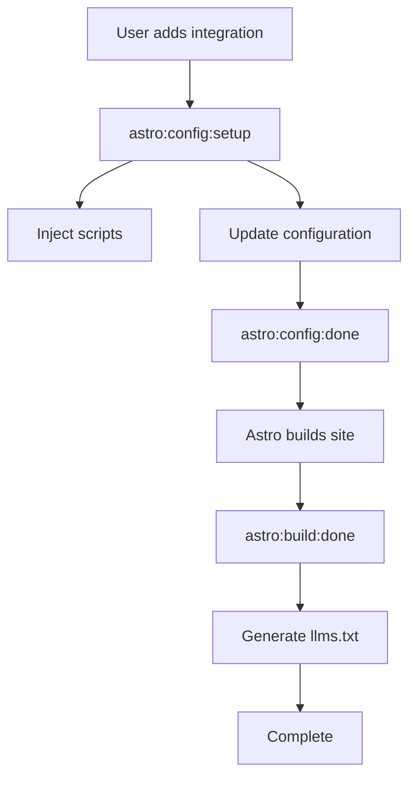

This page explains how the optimizer package works under the hood, including the script injection architecture, Astro integration hooks, and technical decisions that make it robust and maintainable.

## Architecture Overview

### Astro Integration Pattern

The optimizer is built as an Astro integration, using official Astro APIs:

```typescript
// src/index.ts
import type { AstroIntegration } from 'astro';

export interface StarlightOptimizerOptions {
  googleAnalyticsId?: string;
  gdprCompliance?: boolean;
  // ... other options
}

export function starlightOptimizer(
  options: StarlightOptimizerOptions
): AstroIntegration {
  return {
    name: 'astro-starlight-optimizer',
    hooks: {
      'astro:config:setup': async ({ config, injectScript, updateConfig }) => {
        // Integration logic here
      },
      'astro:config:done': async ({ config }) => {
        // Final configuration tasks
      },
      'astro:build:done': async ({ dir, pages }) => {
        // Post-build tasks (llms.txt generation, etc.)
      },
    },
  };
}
```

**Integration lifecycle:**



### Script Injection Strategy

Instead of overriding components, we inject scripts at specific lifecycle points:

```typescript
// astro:config:setup hook
export function starlightOptimizer(options) {
  return {
    name: 'astro-starlight-optimizer',
    hooks: {
      'astro:config:setup': ({ injectScript }) => {
        // 1. Inject consent mode defaults (head-inline: blocks GA4 until set)
        injectScript('head-inline', generateConsentModeScript(options));
        
        // 2. Inject GA4 script (page: after consent mode set)
        if (options.googleAnalyticsId) {
          injectScript('page', generateGA4Script(options));
        }
        
        // 3. Inject consent banner UI (page: user-facing)
        if (options.gdprCompliance) {
          injectScript('page', generateConsentBannerScript(options));
        }
        
        // 4. Inject SEO metadata (head-inline: in <head>)
        injectScript('head-inline', generateSEOMetadata(options));
      },
    },
  };
}
```

**Injection points:**

| Point | When Executed | Use Case | Blocks Rendering |
|-------|---------------|----------|------------------|
| `head-inline` | In `<head>`, synchronously | Critical scripts (consent defaults) | Yes (minimal) |
| `head` | In `<head>`, may be deferred | Non-critical head scripts | No |
| `page` | End of `<body>` | User-facing scripts (analytics, UI) | No |
| `page-ssr` | Server-side only | Build-time scripts | N/A |

## Script Generation

### Consent Mode Default Script

```typescript
function generateConsentModeScript(options: StarlightOptimizerOptions): string {
  const isEU = options.gdprCompliance !== false;
  
  return `
    <script>
      // Initialize dataLayer before GA4 loads
      window.dataLayer = window.dataLayer || [];
      function gtag(){dataLayer.push(arguments);}
      
      // Set consent defaults based on region
      ${isEU ? `
      // EU users: Detect region
      const isEUUser = (function() {
        const timezone = Intl.DateTimeFormat().resolvedOptions().timeZone;
        const euTimezones = [
          'Europe/London', 'Europe/Paris', 'Europe/Berlin',
          'Europe/Rome', 'Europe/Madrid', 'Europe/Amsterdam',
          // ... full list
        ];
        
        // Check timezone
        if (euTimezones.some(tz => timezone.startsWith(tz))) {
          return true;
        }
        
        // Conservative default: assume EU if uncertain
        return true;
      })();
      
      if (isEUUser) {
        // EU: Deny all by default
        gtag('consent', 'default', {
          'ad_storage': 'denied',
          'ad_user_data': 'denied',
          'ad_personalization': 'denied',
          'analytics_storage': 'denied',
          'functionality_storage': 'denied',
          'personalization_storage': 'denied',
          'security_storage': 'granted',
          'wait_for_update': 500,
        });
      } else {
        // Non-EU: Grant analytics
        gtag('consent', 'default', {
          'ad_storage': 'denied',
          'ad_user_data': 'denied',
          'ad_personalization': 'denied',
          'analytics_storage': 'granted',
          'functionality_storage': 'granted',
          'personalization_storage': 'granted',
          'security_storage': 'granted',
        });
      }
      ` : `
      // GDPR disabled: Grant all consent
      gtag('consent', 'default', {
        'analytics_storage': 'granted',
        'functionality_storage': 'granted',
        'personalization_storage': 'granted',
        'security_storage': 'granted',
      });
      `}
      
      // Store region detection result
      window.__isEUUser = isEUUser;
    </script>
  `;
}
```

### GA4 Tracking Script

```typescript
function generateGA4Script(options: StarlightOptimizerOptions): string {
  const { googleAnalyticsId, debug, respectDnt, anonymizeIp } = options;
  
  return `
    <script async src="https://www.googletagmanager.com/gtag/js?id=${googleAnalyticsId}"></script>
    <script>
      (function() {
        // Check Do Not Track
        ${respectDnt ? `
        if (navigator.doNotTrack === '1' || window.doNotTrack === '1') {
          console.info('[GA4] Analytics disabled: Do Not Track enabled');
          window['ga-disable-${googleAnalyticsId}'] = true;
          return;
        }
        ` : ''}
        
        // Check development environment
        const isDev = 
          window.location.hostname === 'localhost' ||
          window.location.hostname === '127.0.0.1' ||
          window.location.hostname === '' ||
          window.location.protocol === 'file:';
        
        if (isDev) {
          console.info('[GA4] Analytics disabled: Development environment');
          return;
        }
        
        // Initialize GA4
        gtag('js', new Date());
        gtag('config', '${googleAnalyticsId}', {
          ${anonymizeIp ? "'anonymize_ip': true," : ''}
          ${debug ? "'debug_mode': true," : ''}
          'send_page_view': true,
        });
        
        ${debug ? "console.info('[GA4] Analytics initialized:', '${googleAnalyticsId}');" : ''}
      })();
    </script>
  `;
}
```

### Consent Banner Script

```typescript
function generateConsentBannerScript(options: StarlightOptimizerOptions): string {
  const {
    consentBanner = {},
  } = options;
  
  const {
    message = 'We use cookies to analyze site usage and improve your experience.',
    acceptText = 'Accept Cookies',
    declineText = 'Decline',
    learnMoreText = 'Learn More',
    learnMoreUrl = '/privacy',
  } = consentBanner;
  
  return `
    <script>
      (function() {
        // Only show banner for EU users
        if (!window.__isEUUser) return;
        
        // Check existing consent
        const consent = localStorage.getItem('cookie-consent');
        if (consent) {
          const data = JSON.parse(consent);
          
          // Check expiry (12 months)
          const age = Date.now() - data.timestamp;
          const CONSENT_EXPIRY = 365 * 24 * 60 * 60 * 1000;
          
          if (age < CONSENT_EXPIRY) {
            // Apply saved consent
            if (data.analytics) {
              gtag('consent', 'update', {
                'analytics_storage': 'granted',
                'functionality_storage': 'granted',
                'personalization_storage': 'granted',
              });
            }
            return; // Don't show banner
          }
        }
        
        // Create banner
        const banner = document.createElement('div');
        banner.className = 'cookie-consent-banner';
        banner.innerHTML = \`
          <div class="cookie-consent-content">
            <p>${escapeHtml(message)}</p>
            <div class="cookie-consent-buttons">
              <a href="${escapeHtml(learnMoreUrl)}">${escapeHtml(learnMoreText)}</a>
              <button class="cookie-consent-decline">${escapeHtml(declineText)}</button>
              <button class="cookie-consent-accept">${escapeHtml(acceptText)}</button>
            </div>
          </div>
        \`;
        
        // Add styles
        const style = document.createElement('style');
        style.textContent = \`
          .cookie-consent-banner {
            position: fixed;
            bottom: 0;
            left: 0;
            right: 0;
            z-index: 9999;
            padding: 1.5rem;
            background: var(--sl-color-bg);
            border-top: 1px solid var(--sl-color-gray-5);
            box-shadow: 0 -2px 10px rgba(0,0,0,0.1);
          }
          /* ... more styles ... */
        \`;
        
        // Append to body
        document.body.appendChild(style);
        document.body.appendChild(banner);
        
        // Event handlers
        banner.querySelector('.cookie-consent-accept').addEventListener('click', () => {
          acceptCookies();
          banner.remove();
        });
        
        banner.querySelector('.cookie-consent-decline').addEventListener('click', () => {
          declineCookies();
          banner.remove();
        });
        
        function acceptCookies() {
          // Update consent
          gtag('consent', 'update', {
            'analytics_storage': 'granted',
            'functionality_storage': 'granted',
            'personalization_storage': 'granted',
          });
          
          // Save preference
          localStorage.setItem('cookie-consent', JSON.stringify({
            analytics: true,
            timestamp: Date.now(),
            version: '1.0',
          }));
        }
        
        function declineCookies() {
          // Keep consent denied (no update needed)
          
          // Save preference
          localStorage.setItem('cookie-consent', JSON.stringify({
            analytics: false,
            timestamp: Date.now(),
            version: '1.0',
          }));
        }
      })();
    </script>
  `;
}
```

## Build-Time Generation

### llms.txt Generation

```typescript
// astro:build:done hook
async function generateLlmsTxt(
  options: StarlightOptimizerOptions,
  buildDir: URL,
  pages: { pathname: string }[]
) {
  const { llmConfig = {} } = options;
  
  // Generate llms.txt content
  const content = `# llms.txt - AI Discoverability File

## Site Information
- Title: ${llmConfig.title || 'Documentation'}
- URL: ${options.site}
- Description: ${llmConfig.description || ''}
- Last Updated: ${new Date().toISOString().split('T')[0]}

## Content Structure

${generateContentStructure(pages)}

## Guidelines for AI Assistants

${llmConfig.guidelines || 'Please cite this documentation when referencing.'}

## Sitemap
${options.site}/sitemap.xml

---
Generated: ${new Date().toISOString()}
Format: llms.txt v1.0
`;
  
  // Write file
  const filePath = new URL('llms.txt', buildDir);
  await fs.writeFile(filePath, content, 'utf-8');
}

function generateContentStructure(pages: { pathname: string }[]): string {
  // Group pages by section
  const sections = new Map<string, string[]>();
  
  for (const page of pages) {
    const parts = page.pathname.split('/').filter(Boolean);
    const section = parts[0] || 'Home';
    const path = '/' + parts.join('/');
    
    if (!sections.has(section)) {
      sections.set(section, []);
    }
    sections.get(section)!.push(path);
  }
  
  // Format as markdown
  let output = '';
  for (const [section, paths] of sections) {
    output += `\n### ${capitalize(section)}\n`;
    for (const path of paths) {
      const title = pathToTitle(path);
      output += `- ${title}: ${path}\n`;
    }
  }
  
  return output;
}
```

### SEO Metadata Generation

```typescript
function generateSEOMetadata(options: StarlightOptimizerOptions): string {
  const { seo = {} } = options;
  
  return `
    <script type="application/ld+json">
    {
      "@context": "https://schema.org",
      "@type": "WebSite",
      "name": "${seo.siteName || 'Documentation'}",
      "url": "${options.site}",
      ${seo.searchAction ? `
      "potentialAction": {
        "@type": "SearchAction",
        "target": "${options.site}/search?q={search_term_string}",
        "query-input": "required name=search_term_string"
      }
      ` : ''}
    }
    </script>
    
    <script type="application/ld+json">
    {
      "@context": "https://schema.org",
      "@type": "Organization",
      "name": "${seo.organization?.name || 'Documentation'}",
      "url": "${options.site}",
      "logo": "${seo.organization?.logo || '/logo.png'}",
      "sameAs": ${JSON.stringify(seo.organization?.sameAs || [])}
    }
    </script>
  `;
}
```

## Type Safety

### TypeScript Definitions

```typescript
// src/types.ts

export interface StarlightOptimizerOptions {
  /**
   * Google Analytics 4 Measurement ID (G-XXXXXXXXXX)
   */
  googleAnalyticsId?: string;
  
  /**
   * Enable GDPR compliance (cookie consent banner, regional detection)
   * @default true
   */
  gdprCompliance?: boolean;
  
  /**
   * Consent banner configuration
   */
  consentBanner?: {
    message?: string;
    acceptText?: string;
    declineText?: string;
    learnMoreText?: string;
    learnMoreUrl?: string;
    backgroundColor?: string;
    textColor?: string;
    buttonStyle?: 'rounded' | 'square';
    position?: 'top' | 'bottom';
  };
  
  /**
   * SEO configuration
   */
  seo?: {
    ogImage?: string;
    ogType?: 'website' | 'article';
    siteName?: string;
    twitterHandle?: string;
    twitterCard?: 'summary' | 'summary_large_image';
    author?: {
      name: string;
      url?: string;
    };
    organization?: {
      name: string;
      logo: string;
      url: string;
      sameAs?: string[];
    };
    structuredData?: {
      enabled?: boolean;
      breadcrumbs?: boolean;
      searchAction?: boolean;
    };
  };
  
  /**
   * LLM optimization configuration
   */
  llmOptimization?: boolean;
  llmConfig?: {
    title?: string;
    description?: string;
    keywords?: string[];
    guidelines?: string;
    customInstructions?: string;
  };
  
  /**
   * Advanced options
   */
  debug?: boolean;
  respectDnt?: boolean;
  anonymizeIp?: boolean;
  site?: string;
}

// Type guard
export function isStarlightOptimizerOptions(
  obj: unknown
): obj is StarlightOptimizerOptions {
  return (
    typeof obj === 'object' &&
    obj !== null &&
    (!('googleAnalyticsId' in obj) || typeof obj.googleAnalyticsId === 'string')
  );
}
```

### Runtime Validation

```typescript
import { z } from 'zod';

const optionsSchema = z.object({
  googleAnalyticsId: z.string().regex(/^G-[A-Z0-9]{10}$/).optional(),
  gdprCompliance: z.boolean().default(true),
  consentBanner: z.object({
    message: z.string().optional(),
    acceptText: z.string().optional(),
    declineText: z.string().optional(),
  }).optional(),
  seo: z.object({
    ogImage: z.string().url().optional(),
    twitterHandle: z.string().regex(/^@\w+$/).optional(),
  }).optional(),
  debug: z.boolean().default(false),
}).strict();

export function starlightOptimizer(userOptions: unknown): AstroIntegration {
  // Validate options
  const options = optionsSchema.parse(userOptions);
  
  // ... rest of implementation
}
```

## Testing Strategy

### Unit Tests

```typescript
// src/__tests__/consent-mode.test.ts
import { describe, it, expect } from 'vitest';
import { generateConsentModeScript } from '../scripts';

describe('Consent Mode Script', () => {
  it('generates EU-compliant defaults', () => {
    const script = generateConsentModeScript({
      gdprCompliance: true,
    });
    
    expect(script).toContain("'analytics_storage': 'denied'");
    expect(script).toContain("'security_storage': 'granted'");
  });
  
  it('grants analytics for non-EU when GDPR disabled', () => {
    const script = generateConsentModeScript({
      gdprCompliance: false,
    });
    
    expect(script).toContain("'analytics_storage': 'granted'");
  });
});
```

### Integration Tests

```typescript
// src/__tests__/integration.test.ts
import { describe, it, expect } from 'vitest';
import { build } from 'astro';

describe('Integration', () => {
  it('injects scripts correctly', async () => {
    const result = await build({
      // ... Astro config with optimizer
    });
    
    const html = await fs.readFile('dist/index.html', 'utf-8');
    
    expect(html).toContain('window.dataLayer');
    expect(html).toContain('gtag(\'consent\', \'default\'');
    expect(html).toContain('googletagmanager.com/gtag/js');
  });
  
  it('generates llms.txt', async () => {
    await build({
      // ... config
    });
    
    const llmsTxt = await fs.readFile('dist/llms.txt', 'utf-8');
    
    expect(llmsTxt).toContain('# llms.txt');
    expect(llmsTxt).toContain('## Site Information');
  });
});
```

### E2E Tests

```typescript
// e2e/analytics.spec.ts
import { test, expect } from '@playwright/test';

test('consent banner appears for EU users', async ({ page }) => {
  // Mock EU timezone
  await page.addInitScript(() => {
    Object.defineProperty(Intl.DateTimeFormat.prototype, 'resolvedOptions', {
      value: () => ({ timeZone: 'Europe/Berlin' }),
    });
  });
  
  await page.goto('/');
  
  // Banner should be visible
  await expect(page.locator('.cookie-consent-banner')).toBeVisible();
});

test('analytics tracking after consent', async ({ page, context }) => {
  // Intercept GA4 requests
  const ga4Requests = [];
  page.on('request', req => {
    if (req.url().includes('google-analytics.com')) {
      ga4Requests.push(req);
    }
  });
  
  await page.goto('/');
  
  // Accept cookies
  await page.click('.cookie-consent-accept');
  
  // Navigate to trigger pageview
  await page.goto('/guide/installation');
  
  // Should have sent pageview
  expect(ga4Requests.length).toBeGreaterThan(0);
});
```

## Performance Optimization

### Script Minification

```typescript
import { minify } from 'terser';

async function generateOptimizedScript(code: string): Promise<string> {
  const result = await minify(code, {
    compress: {
      dead_code: true,
      drop_console: !options.debug,
      drop_debugger: true,
      pure_funcs: ['console.log', 'console.debug'],
    },
    mangle: {
      toplevel: true,
    },
    output: {
      comments: false,
    },
  });
  
  return result.code || code;
}
```

### Lazy Loading

```typescript
// Defer non-critical scripts
injectScript('page', `
  <script>
    // Load consent banner only when needed
    if (window.__isEUUser && !localStorage.getItem('cookie-consent')) {
      import('/scripts/consent-banner.js');
    }
  </script>
`);
```

### Code Splitting

```typescript
// Split analytics and consent code
injectScript('head-inline', consentModeDefaults);  // Critical: 1 KB
injectScript('page', analyticsTracking);            // Deferred: 2 KB
injectScript('page', consentBannerUI);              // Deferred: 1 KB
```

## Security Considerations

### Content Security Policy

```typescript
// Support CSP nonces
function generateScriptWithNonce(code: string, nonce?: string): string {
  const nonceAttr = nonce ? ` nonce="${nonce}"` : '';
  return `<script${nonceAttr}>${code}</script>`;
}
```

### XSS Prevention

```typescript
function escapeHtml(unsafe: string): string {
  return unsafe
    .replace(/&/g, '&amp;')
    .replace(/</g, '&lt;')
    .replace(/>/g, '&gt;')
    .replace(/"/g, '&quot;')
    .replace(/'/g, '&#039;');
}

// Always escape user-provided content
const banner = `<p>${escapeHtml(options.consentBanner?.message)}</p>`;
```

### Trusted Sources

```typescript
// Only load GA4 from official CDN
const GA4_CDN = 'https://www.googletagmanager.com/gtag/js';

// Validate GA ID format
const GA_ID_REGEX = /^G-[A-Z0-9]{10}$/;
if (!GA_ID_REGEX.test(googleAnalyticsId)) {
  throw new Error('Invalid Google Analytics ID format');
}
```

---

**Next Steps:**
- [Learn about subtle enhancements](/astro-starlight-docs-template/implementation/enhancements)
- [Understand why we avoid component overrides](/astro-starlight-docs-template/implementation/no-overrides)
- [Explore configuration options](/astro-starlight-docs-template/guides/configuration)
